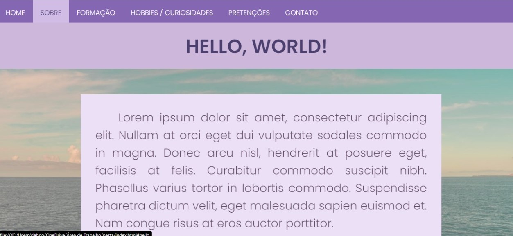
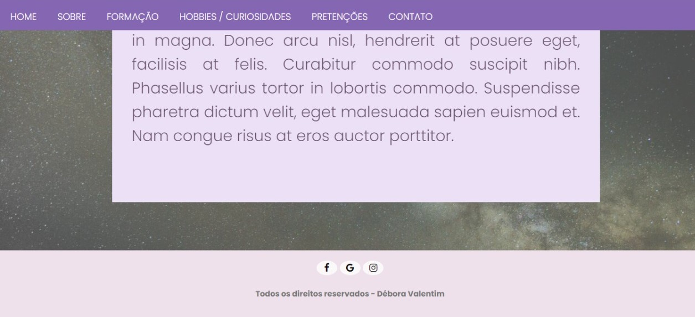

# Site-Danielle
This is a website I made for a friend who is going to participate in a selection from a company and needs a presentation web page. Here I used HTML5 and CSS3. :)
It's a one-page website, with a fixed bar menu and links to her social media.

#### P.S.: 
* The images, links, and texts were modified, to protect her identity;

## This is the first view of the website

## This is how the sections are

## This is the contact area

